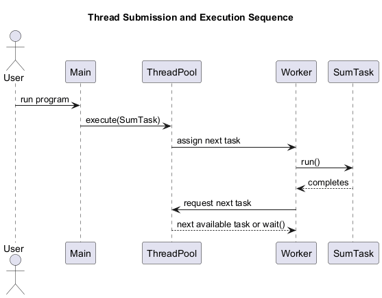
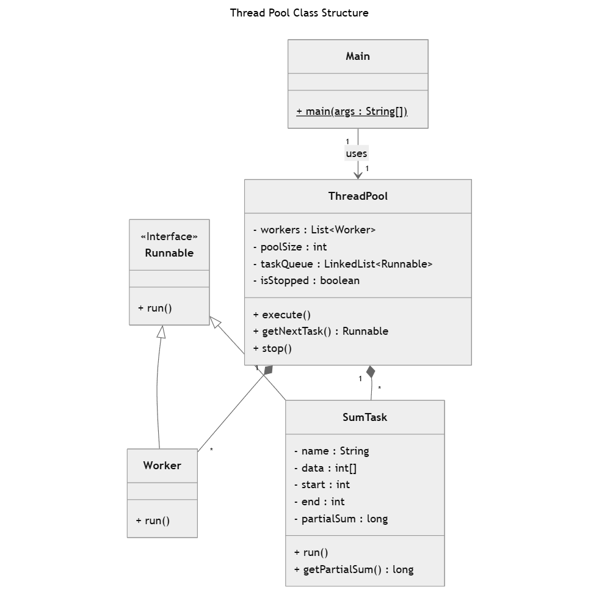

# Thread Pooling Implementation — Assignment 3

**Course:** Software Architecture  
**Language:** Java  
**Assignment:** Thread Pooling Architectural Tactic  

---

## 1 Description

This project demonstrates the *Thread Pooling* architectural tactic using a simple, self-contained Java program.  
The goal is to show how reusing a fixed set of threads can improve performance and reduce overhead when executing many concurrent tasks.

The chosen domain is **numerical computation** — specifically, **summing a large array of integers** in parallel using 10 reusable threads.

Each thread retrieves tasks from a shared queue and executes them in parallel. Once a thread finishes, it is reused for the next task in the queue.

---

## 2 Requirements

- Java 17 or newer  
- No external libraries required  
- Works on any system with a standard Java runtime environment  

---

## 3 How to Run

```bash
cd src
javac *.java
java Main
```

---

## 4 Expected Output

```console
Worker-1        SumTask = 0 - 100,000                    sum = 4,956,451
Worker-2        SumTask = 100,000 - 200,000              sum = 4,951,000
Worker-3        SumTask = 300,000 - 400,000              sum = 4,943,148
...
Final total sum = 494,963,753
```

The console output shows multiple worker threads executing tasks in parallel, and the final summed result at the end.

---

## 5 Design Overview

| File | Description |
| - | - |
| **ThreadPool.java** | Implements a basic thread pool with a shared task queue and 10 reusable worker threads. |
| **SumTask.java** | Defines a performance-critical computation (partial array summation). |
| **Main.java** | Generates data, submits multiple tasks to the pool, and aggregates partial results into a final total. |

Key Design Points

- **Thread reuse:** Threads are created once and reused for new tasks.
- **Task queueing:** More tasks than threads are handled by queuing them.
- **Synchronization:** Uses wait() and notify() to manage thread coordination safely.
- **Scalability:** Can handle any number of tasks without creating new threads.

---

## 6 Libraries Used

Only standard Java libraries:

- `java.util`
- `java.lang`

No external dependencies or internet connections are required.

---

## 7 Discussion

This implementation demonstrates the **Thread Pooling architectural tactic** for improving **performance** and **resource efficiency**.

### Benefits

- Reduced thread creation overhead
- Better CPU utilization through parallel execution
- Controlled concurrency (fixed number of threads)

### Observations

- Performance improves significantly compared to a single-threaded implementation for large workloads.
- The thread pool can easily be adapted for other computational or I/O-bound tasks.

## 8 Documentation

Thread Pool Sequence Diagram



Thread Pool Class Diagram


